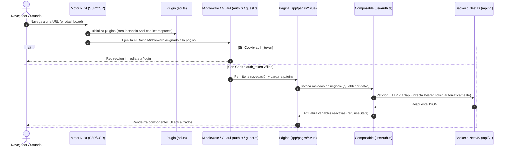

# 🏛️ Documentación de Arquitectura y Guía de Desarrollo - Frontend

> **Proyecto:** Vamos Aprendiendo Web  
> **Framework:** Nuxt 4 (Nuxt 4.4.x + Vue 3.5.x + TypeScript)  
> **Librería UI:** PrimeVue v4 (Tema Aura) + Sass Embedded  
> **Backend conectado:** NestJS API REST (`http://localhost:3000/api/v1`)

---

## 📑 Tabla de Contenidos
1. [Visión General del Stack y Arquitectura](#1-visión-general-del-stack-y-arquitectura)
2. [Estructura de Carpetas y Responsabilidades](#2-estructura-de-carpetas-y-responsabilidades)
3. [Flujo de Ejecución y Ciclo de Vida de la Aplicación](#3-flujo-de-ejecución-y-ciclo-de-vida-de-la-aplicación)
4. [Manejo de Cookies y Estado de Autenticación](#4-manejo-de-cookies-y-estado-de-autenticación)
5. [Consumo de Servicios del Backend](#5-consumo-de-servicios-del-backend)
6. [Guía de Creación: Componentes](#6-guía-de-creación-componentes)
7. [Guía de Creación: Pages (Rutas y Páginas)](#7-guía-de-creación-pages-rutas-y-páginas)
8. [Guía de Creación: Módulos](#8-guía-de-creación-módulos)
9. [Guía de Creación: Guards (Route Middleware)](#9-guía-de-creación-guards-route-middleware)
10. [Buenas Prácticas y Convenciones del Proyecto](#10-buenas-prácticas-y-convenciones-del-proyecto)

---

## 1. Visión General del Stack y Arquitectura

El frontend está desarrollado bajo el paradigma **SSR / SPA Híbrido** provisto por **Nuxt 4**. Utiliza la nueva estructura canónica de Nuxt donde el código fuente de la aplicación reside en el directorio `app/`.

### Características Principales:
- **Auto-import inteligente:** Nuxt importa automáticamente componentes, composables (`useAuth`, `useCookie`, `useRoute`, `navigateTo`), funciones de Vue (`ref`, `computed`, `reactive`) y utilidades sin necesidad de declaraciones `import` manuales redundantes.
- **Enrutamiento basado en archivos:** La jerarquía de archivos en `app/pages/` genera automáticamente el mapa de rutas de Vue Router.
- **PrimeVue 4 con tema Aura:** Componentes estilizados configurados mediante `@primevue/nuxt-module`.
- **Comunicación HTTP centralizada:** Cliente `$fetch` personalizado provisto como plugin `$api` con interceptores de autenticación y manejo global de errores (401).

---

## 2. Estructura de Carpetas y Responsabilidades

```text
frontend/
├── .env                  # Variables de entorno locales (puerto, URL backend)
├── .env.example          # Plantilla de variables de entorno
├── nuxt.config.ts        # Configuración principal de Nuxt, módulos, vite y runtimeConfig
├── package.json          # Dependencias y scripts de ejecución
├── tsconfig.json         # Configuración del compilador TypeScript
├── public/               # Archivos estáticos servidos directamente en la raíz (ej: /avatar.png)
└── app/                  # Directorio raíz del código fuente (convención Nuxt 4)
    ├── app.vue           # Componente raíz maestro (punto de entrada visual)
    ├── assets/           # Recursos procesados por Vite (SCSS, estilos globales, imágenes)
    │   ├── css/          # Hojas de estilo CSS
    │   ├── scss/         # Archivos Sass/SCSS compilables (main.scss)
    │   └── img/          # Imágenes e ilustraciones importables en componentes
    ├── components/       # Componentes Vue reutilizables (auto-importados)
    │   └── ui/           # Componentes atómicos de diseño (UiButton, UiCard, UiInput, UiModal)
    ├── composables/      # Lógica de negocio reutilizable, hooks y gestión de estado
    │   └── useAuth.ts    # Composable de autenticación, sesión y perfil de niño
    ├── middleware/       # Route Middleware (los "Guards" de Nuxt/Vue)
    │   ├── auth.ts       # Protege rutas privadas (exige token)
    │   └── guest.ts      # Protege rutas de invitados (login/register si ya está autenticado)
    ├── pages/            # Vistas y páginas mapeadas automáticamente a URLs
    │   ├── index.vue             # Redirección inicial según token
    │   ├── login.vue             # Vista de inicio de sesión
    │   ├── register.vue          # Vista de registro de acudiente/usuario
    │   ├── child-registration.vue# Registro y setup del perfil del estudiante
    │   ├── profile-selection.vue # Selección de perfil ("¿Quién aprende hoy?")
    │   ├── home.vue              # Vista principal / Landing del usuario
    │   └── dashboard.vue         # Panel de control de administración o aprendizaje
    └── plugins/          # Plugins que se ejecutan antes de montar la aplicación
        └── api.ts        # Inyector del cliente HTTP $api con interceptores
```

### Detalle por Directorio:

| Carpeta | Rol Arquitectónico | ¿Se auto-importa? |
| :--- | :--- | :---: |
| **`app/pages/`** | Vistas y controladores de rutas de la aplicación. | Sí (enrutador) |
| **`app/components/`** | Elementos visuales reutilizables. Si se guardan en `ui/UiButton.vue`, se usan como `<UiButton />`. | Sí |
| **`app/composables/`** | Funciones que encapsulan estado reactivo (`useState`) y lógica de negocio. | Sí |
| **`app/middleware/`** | Guardianes de navegación que interceptan cambios de ruta antes de renderizar la página. | Sí (por nombre) |
| **`app/plugins/`** | Inicializadores de librerías, clientes HTTP y servicios globales inyectados vía `provide`. | Sí |
| **`app/assets/`** | Estilos Sass/CSS e imágenes que requieren optimización por Vite (`~/assets/...`). | No |
| **`public/`** | Archivos servidos tal cual en la raíz del servidor web (`/favicon.ico`, `/avatar.png`). | Servidor web |

---

## 3. Flujo de Ejecución y Ciclo de Vida de la Aplicación

El siguiente diagrama ilustra cómo fluye una petición desde que el usuario ingresa una URL hasta que se muestra la interfaz:



---

## 4. Manejo de Cookies y Estado de Autenticación

### ¿Ya usamos cookies en el proyecto?
**SÍ, el proyecto ya utiliza cookies activamente** mediante la utilidad nativa reactiva de Nuxt: `useCookie<T>()`.

### Cookies actuales en uso:
1. **`auth_token`**: Almacena el JWT emitido por el backend (expira en 7 días, `sameSite: 'lax'`).
2. **`refresh_token`**: Almacena el token de refresco para renovar la sesión (expira en 7 días).
3. **`has_child_profile`**: Booleano que indica si el acudiente ya completó el perfil del menor (expira en 30 días).

### Dónde se usan en el código actual:
- **`app/composables/useAuth.ts`**:
  ```ts
  const token = useCookie<string | null>('auth_token', {
    maxAge: 60 * 60 * 24 * 7, // 7 días
    sameSite: 'lax'
  })
  ```
- **`app/plugins/api.ts`**: Lee la cookie `auth_token` para inyectar automáticamente el encabezado `Authorization: Bearer <token>` en cada petición saliente.
- **`app/middleware/auth.ts`**: Verifica `if (!token.value)` para proteger rutas privadas.
- **`app/middleware/guest.ts`**: Verifica `if (token.value)` para evitar que un usuario autenticado vuelva a `/login`.

### Cómo crear o usar una nueva Cookie:
```ts
// En cualquier composable o página:
const userPreferences = useCookie<{ theme: string; language: string }>('user_prefs', {
  default: () => ({ theme: 'dark', language: 'es' }),
  maxAge: 60 * 60 * 24 * 365, // 1 año
  sameSite: 'lax',
  secure: process.env.NODE_ENV === 'production', // true en producción
  httpOnly: false // accesible desde JS cliente si se requiere leer
})

// Leer:
console.log(userPreferences.value.theme)

// Modificar (se sincroniza automáticamente en el navegador y en el servidor SSR):
userPreferences.value.theme = 'light'

// Borrar / invalidar cookie:
userPreferences.value = null
```

---

## 5. Consumo de Servicios del Backend

### 1. Configuración de la URL Base
En [nuxt.config.ts](file:///e:/SENA/Proyecto%20productivo/vamos-aprendiendo-web/frontend/nuxt.config.ts) se define la variable de configuración pública:
```ts
runtimeConfig: {
  public: {
    apiBase: process.env.NUXT_PUBLIC_API_BASE || 'http://localhost:3000/api/v1'
  }
}
```
En `.env` se puede sobreescribir: `NUXT_PUBLIC_API_BASE=http://localhost:3000/api/v1`.

### 2. El Cliente Centralizado `$api`
En [app/plugins/api.ts](file:///e:/SENA/Proyecto%20productivo/vamos-aprendiendo-web/frontend/app/plugins/api.ts) se crea una instancia especializada de `$fetch`:
- **Inyección automática del Token:** En cada request toma la cookie `auth_token` e incluye `Authorization: Bearer <token>`.
- **Manejo de expiración (401 Unauthorized):** Si el backend responde `401`, limpia la cookie `auth_token` y redirige automáticamente al usuario a `/login`.

### 3. Patrón Recomendado para Consumir Endpoints
Nunca se debe llamar a `$fetch` o `axios` directamente dentro de las vistas (`pages/*.vue`). Toda llamada al backend debe encapsularse en un **Composable**.

#### Ejemplo: Creando un composable de servicio `useCourses.ts`:
Crear el archivo `app/composables/useCourses.ts`:
```ts
export interface Course {
  id: string
  title: string
  description: string
  difficulty: 'facil' | 'intermedio' | 'avanzado'
}

export const useCourses = () => {
  const { $api } = useNuxtApp()
  const loading = ref(false)
  const error = ref<string | null>(null)
  const courses = useState<Course[]>('course_list', () => [])

  // 1. Obtener listado de cursos (GET)
  const fetchCourses = async () => {
    loading.value = true
    error.value = null
    try {
      const data = await $api<Course[]>('/courses', {
        method: 'GET'
      })
      courses.value = data
      return data
    } catch (err: any) {
      error.value = err.data?.message || 'Error al cargar cursos'
      throw err
    } finally {
      loading.value = false
    }
  }

  // 2. Crear nuevo curso (POST)
  const createCourse = async (courseData: Partial<Course>) => {
    loading.value = true
    try {
      const newCourse = await $api<Course>('/courses', {
        method: 'POST',
        body: courseData
      })
      courses.value.push(newCourse)
      return newCourse
    } catch (err: any) {
      error.value = err.data?.message || 'Error al crear curso'
      throw err
    } finally {
      loading.value = false
    }
  }

  return {
    courses,
    loading,
    error,
    fetchCourses,
    createCourse
  }
}
```

---

## 6. Guía de Creación: Componentes

Nuxt 4 auto-importa cualquier componente ubicado en `app/components/`.

### Convención de carpetas y nombres:
- Si creas `app/components/ui/UiBadge.vue`, el componente se llamará automáticamente `<UiBadge />`.
- Si creas `app/components/courses/CourseCard.vue`, se llamará `<CoursesCourseCard />` o `<CourseCard />`.

### Plantilla estándar con `<script setup lang="ts">`:

```vue
<!-- app/components/ui/UiBadge.vue -->
<script setup lang="ts">
// 1. Definición tipada de Props
interface Props {
  variant?: 'info' | 'success' | 'warning' | 'danger'
  label: string
  icon?: string
}

// 2. Valores por defecto
const props = withDefaults(defineProps<Props>(), {
  variant: 'info',
  icon: undefined
})

// 3. Emits tipados (eventos hacia el padre)
const emit = defineEmits<{
  (e: 'click'): void
}>()
</script>

<template>
  <span 
    class="ui-badge" 
    :class="`variant-${variant}`" 
    @click="emit('click')"
  >
    <i v-if="icon" :class="icon" class="badge-icon"></i>
    <span class="badge-text">{{ label }}</span>
  </span>
</template>

<style scoped lang="scss">
.ui-badge {
  display: inline-flex;
  align-items: center;
  gap: 0.35rem;
  padding: 0.25rem 0.65rem;
  border-radius: 9999px;
  font-size: 0.75rem;
  font-weight: 600;
  cursor: pointer;

  &.variant-success {
    background-color: rgba(34, 197, 94, 0.15);
    color: #4ade80;
    border: 1px solid rgba(34, 197, 94, 0.3);
  }

  &.variant-danger {
    background-color: rgba(239, 68, 68, 0.15);
    color: #f87171;
    border: 1px solid rgba(239, 68, 68, 0.3);
  }
}
</style>
```

---

## 7. Guía de Creación: Pages (Rutas y Páginas)

Toda vista se coloca en `app/pages/`. Cada archivo genera una ruta web.

### Reglas de Enrutamiento:
- `app/pages/index.vue` -> `/`
- `app/pages/login.vue` -> `/login`
- `app/pages/courses/index.vue` -> `/courses`
- `app/pages/courses/[id].vue` -> `/courses/:id` (Ruta dinámica)

### Plantilla de una Página Completa con Meta y Protección:

```vue
<!-- app/pages/courses/[id].vue -->
<script setup lang="ts">
// 1. Metadatos de la página (Layouts, Guards / Middleware)
definePageMeta({
  middleware: ['auth'], // Asigna el Guard de autenticación
  layout: 'default'     // Asigna el Layout (si se usan layouts)
})

// 2. Parámetros de la ruta
const route = useRoute()
const courseId = route.params.id as string

// 3. SEO y Head dinámico
useHead({
  title: `Curso #${courseId} - Vamos Aprendiendo`
})

// 4. Invocación de composables
const { courses, fetchCourses, loading } = useCourses()

onMounted(async () => {
  await fetchCourses()
})
</script>

<template>
  <div class="course-detail-container">
    <h1>Detalle del Curso: {{ courseId }}</h1>
    <div v-if="loading" class="loading-state">
      <p>Cargando información...</p>
    </div>
    <div v-else>
      <!-- Usando el componente UiCard existente -->
      <UiCard title="Información del Módulo">
        <p>Contenido del curso...</p>
      </UiCard>
    </div>
  </div>
</template>

<style scoped lang="scss">
.course-detail-container {
  padding: 2rem;
  max-width: 1200px;
  margin: 0 auto;
}
</style>
```

---

## 8. Guía de Creación: Módulos

En el ecosistema Nuxt existen **dos tipos de conceptos** para la palabra "Módulo":

### Opción A: Módulo de Dominio / Feature (Arquitectura de Negocio)
Si vienes de Angular o NestJS y deseas organizar tu código por dominios (ej: Módulo Auth, Módulo Cursos, Módulo Estudiantes), en Nuxt se agrupan mediante subcarpetas limpias:
- `app/components/courses/` -> Componentes de la funcionalidad.
- `app/composables/useCourses.ts` -> Servicios y lógica del módulo.
- `app/pages/courses/` -> Vistas del módulo.

### Opción B: Módulo de Nuxt (Integraciones del Framework)
Un módulo de Nuxt extiende el ciclo de compilación o inyecta librerías externas (como `@primevue/nuxt-module`).

Para instalar y registrar un nuevo módulo de Nuxt:
1. Instalar la librería:
   ```bash
   npm install @nuxtjs/color-mode
   ```
2. Registrarlo en `nuxt.config.ts`:
   ```ts
   export default defineNuxtConfig({
     modules: [
       '@primevue/nuxt-module',
       '@nuxtjs/color-mode' // <-- Nuevo módulo añadido
     ]
   })
   ```

---

## 9. Guía de Creación: Guards (Route Middleware)

En Nuxt y Vue, el concepto de **Guard** (como el `CanActivate` de Angular) se denomina **Route Middleware**.

Los Guards se ubican en `app/middleware/`. Nuxt los detecta automáticamente por su nombre de archivo.

### 1. Guards Existentes en el Proyecto
- [app/middleware/auth.ts](file:///e:/SENA/Proyecto%20productivo/vamos-aprendiendo-web/frontend/app/middleware/auth.ts):
  ```ts
  export default defineNuxtRouteMiddleware((to, from) => {
    const token = useCookie('auth_token')
    if (!token.value) {
      return navigateTo('/login')
    }
  })
  ```
- [app/middleware/guest.ts](file:///e:/SENA/Proyecto%20productivo/vamos-aprendiendo-web/frontend/app/middleware/guest.ts):
  ```ts
  export default defineNuxtRouteMiddleware((to, from) => {
    const token = useCookie('auth_token')
    if (token.value) {
      return navigateTo('/home')
    }
  })
  ```

### 2. Cómo Crear un Nuevo Guard (Ejemplo: Guard de Roles `role.ts`)
Crear el archivo `app/middleware/role.ts`:
```ts
// app/middleware/role.ts
export default defineNuxtRouteMiddleware((to, from) => {
  const token = useCookie('auth_token')
  const { user } = useAuth()

  // 1. Si ni siquiera está autenticado, al login
  if (!token.value) {
    return navigateTo('/login')
  }

  // 2. Comprobar roles requeridos especificados en la meta de la página
  const requiredRoles = to.meta.requiredRoles as string[] | undefined

  if (requiredRoles && requiredRoles.length > 0) {
    const userRole = user.value?.role || 'STUDENT'
    
    if (!requiredRoles.includes(userRole)) {
      // Si no tiene permisos, redirigir a vista no autorizada o al inicio
      return navigateTo('/home')
    }
  }
})
```

### 3. Cómo Aplicar el Guard en una Página
En cualquier página (`app/pages/admin.vue`):
```vue
<script setup lang="ts">
definePageMeta({
  middleware: ['role'],
  requiredRoles: ['ADMIN', 'TEACHER'] // Parámetro leído por el Guard
})
</script>
```

### 4. Guard Global (Aplica a todas las rutas sin excepción)
Si nombras el archivo con el sufijo `.global.ts` (ej: `app/middleware/analytics.global.ts`), se ejecutará automáticamente en cada navegación sin necesidad de declararlo en `definePageMeta`.

---

## 10. Buenas Prácticas y Convenciones del Proyecto

1. **Variables Reactivas Compartidas:**
   - Usa `useState('key', () => initValue)` en los composables en lugar de `ref()` para estados que deben persistir entre páginas o renderizarse de manera consistente en SSR.
2. **Navegación Programática:**
   - Usa `await navigateTo('/ruta')` provisto por Nuxt en lugar de `window.location.href` o `$router.push`.
3. **Consumo de la API:**
   - Consume siempre a través de `const { $api } = useNuxtApp()` para garantizar que el Bearer token viaje automáticamente y que los errores 401 sean tratados sin duplicar lógica.
4. **Manejo de Errores en Formularios:**
   - Lee `error.value` del composable y muéstralo al usuario mediante componentes UI reutilizables (como los existentes en `app/components/ui/`).
5. **Estilos:**
   - Utiliza las variables CSS maestras definidas en `app/assets/scss/main.scss` (ej: `var(--color-primary-500)`, `var(--radius-md)`) para mantener coherencia cromática y estética premium.
